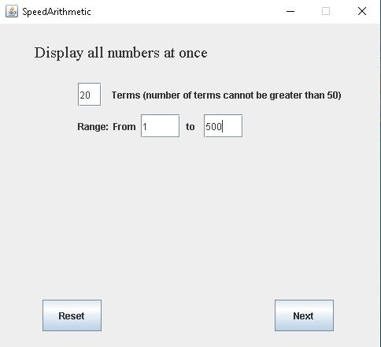
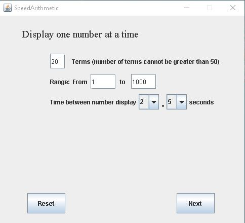
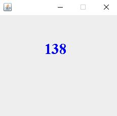
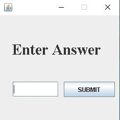

# SpeedArithmetic
> Created Spring 2020 This project was created to simulate practices for abacus mental arithmetic. 
Abacus mental arithmetic practice is where the user gets a series of numbers and performs the designated operation on it.  The answer is then computed as soon as possible. 
This program generates random numbers “x”, where “x” is specified between the range determined by the user.
The user inputs the computed answer and the program checks the inputted answer against the answer computed by the system after performing the specified operation on the series of numbers. 

## Table of contents
* [Screenshots](#screenshots)
* [Setup](#setup)
* [Prerequisites](#prerequisites)
* [Inspiration](#inspiration)
* [Future Development](#future-development)
* [Contact](#contact)

## Screenshots

## Setup
If you would like to run the program, simply download the code to your local device. Then, run the "SpeedArithmetic.jar" file on your device. 

## Prerequisites
Make sure you have the latest version of Java SE Development Kit.  
Click [here](https://www.oracle.com/java/technologies/javase/javase-jdk8-downloads.html) to download the latest Java SE Development Kit.

## Inspiration
This project was inspired when I was practicing my abacus mental arithmetic. It was very incovenient for me to randomly generate numbers from the calculator then adding them up so I decided to make this project. 

## Future Development
Include voice that would read the numbers one at a time when the numbers are generated. This way, it could simulate the hearing part of the competition. 

## Contact
Created by [Kenzie Tee](https://www.linkedin.com/in/kenzie-tee-1276701b2/) - feel free to contact me!
